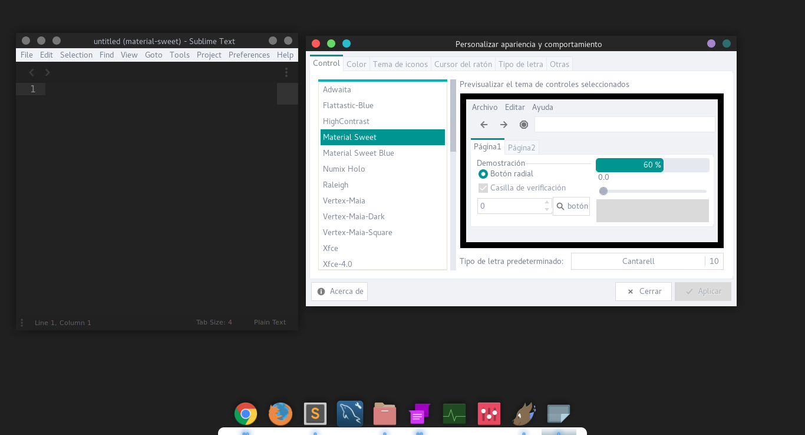
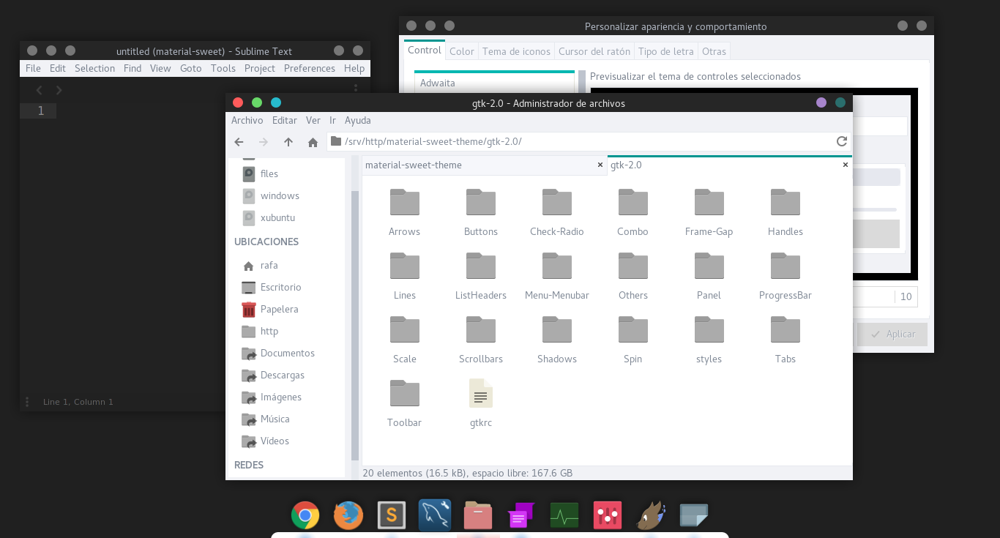

# Material Sweet is a gtk 2.0 theme

At the moment only it has one base color, and included most of SVG (Inkscape) and XCF (Gimp) files that i used.

# Installation

* Download and unzip the .zip file in the folder /home/user/.themes/